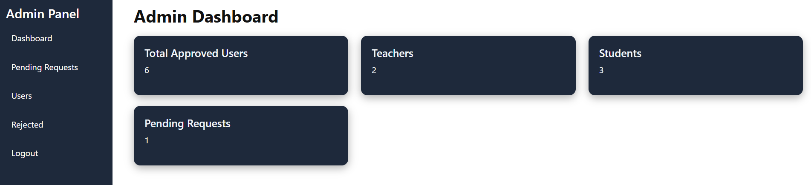
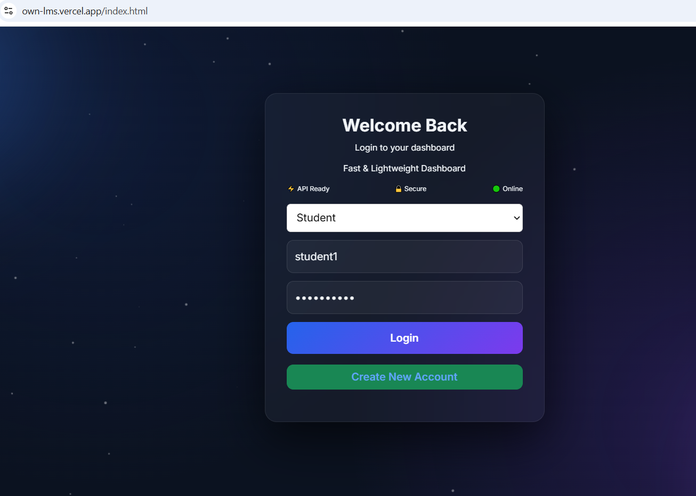
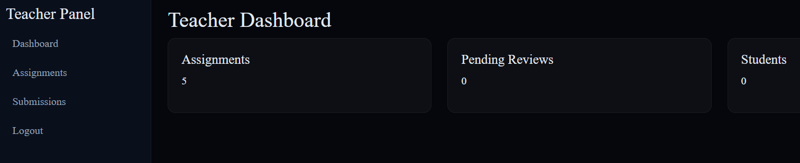
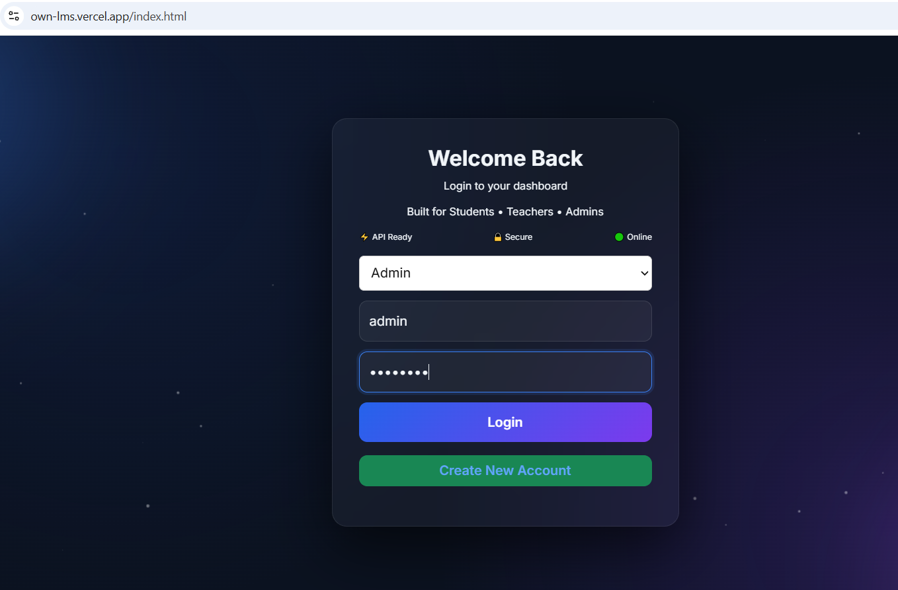
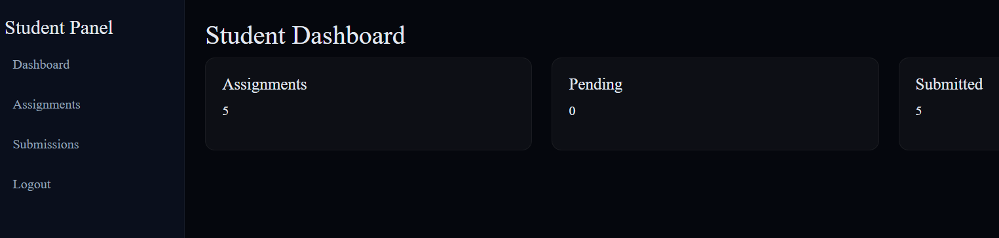
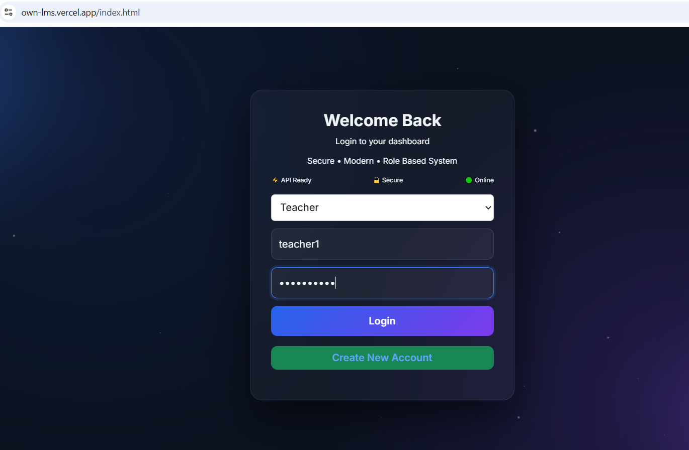

# Learning Management System (LMS)

A **Learning Management System (LMS)** built with **Django**, **Django REST Framework**, and **JWT Authentication**. The platform provides a secure, role-based learning environment where **Admins** manage user approvals, **Teachers** create and review assignments, and **Students** submit their work through a RESTful API.

**Live Demo:** https://own-lms.vercel.app

## Features

### Authentication

* User registration and login
* JWT authentication (Access & Refresh Tokens)
* Secure password hashing
* Protected API endpoints

### Admin

* Approve or reject new account requests
* View total approved users, teachers, and students
* Monitor pending account requests

### Teacher

* Create assignments
* Update assignments
* Delete assignments
* View all assignments
* Review student submissions

### Student

* View available assignments
* Submit assignment solutions
* Track submission status (Pending / Submitted)

## Tech Stack

* **Backend:** Python, Django, Django REST Framework
* **Authentication:** JWT (Simple JWT)
* **Database:** SQLite
* **Frontend:** HTML, CSS, JavaScript
* **Deployment:** Vercel

## Project Structure

```text
learning-management-system/
├── assignment/
├── submissions/
├── users/
├── core/
├── frontend/
├── manage.py
├── requirements.txt
├── Procfile
├── db.sqlite3
└── .gitignore
```

**users/** — User registration, login, JWT generation, and role management

**assignment/** — Assignment CRUD operations

**submissions/** — Student submissions, submission history, and assignment linking

**core/** — Project settings, URL routing, middleware, and authentication configuration

## REST API

### Authentication

* Register
* Login
* Refresh Token
* User Profile

### Assignments

* Create
* Retrieve
* Update
* Delete

### Submissions

* Submit Assignment
* View Submission
* View All Submissions

## Architecture

```text
Client → Frontend (HTML/CSS/JS) → REST API → Django REST Framework → SQLite
```

## Installation

```bash
git clone https://github.com/Sohaib448/learning-management-system.git

cd learning-management-system

python -m venv venv

# Linux / macOS
source venv/bin/activate

# Windows
venv\Scripts\activate

pip install -r requirements.txt

python manage.py migrate

python manage.py createsuperuser

python manage.py runserver
```

## Screenshots

### Admin

**Login**



**Dashboard**



### Teacher

**Login**



**Dashboard**



### Student

**Login**



**Dashboard**



## Deployment

The project is deployed on **Vercel**. The backend is configured for production using a **Procfile** with appropriate **CORS** settings for the frontend domain.

## Learning Outcomes

This project helped strengthen practical knowledge of:

* Django
* Django REST Framework
* JWT Authentication
* REST API Development
* Role-Based Authorization
* CRUD Operations
* Database Relationships
* API Testing with Postman
* Frontend Integration
* Deployment Preparation
* Git & GitHub Workflow

## Future Improvements

* File upload support
* Assignment grading
* Teacher feedback
* Email notifications
* Email verification
* Course management
* Attendance system
* Admin analytics dashboard
* Docker support
* PostgreSQL integration
* Redis caching
* CI/CD pipeline

## Author

**Sohaib Nisar**

Backend Developer | Python | Django | Django REST Framework

**GitHub:** https://github.com/Sohaib448

## License

This project is intended for educational purposes and portfolio demonstration.
